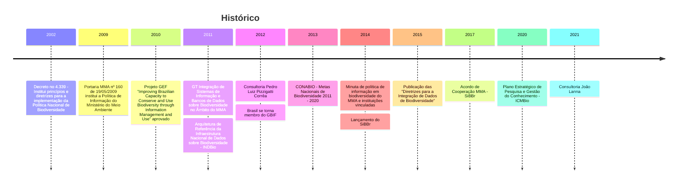

```mermaid
timeline
    title Histórico
    2002 : Decreto no 4.339 - Institui princípios e diretrizes para a implementação da Política Nacional de Biodiversidade
    2009 : Portaria MMA nº 160 de 19/05/2009 institui a Política de Informação do Ministério do Meio Ambiente
    2010 : Projeto GEF "Improving Brazilian Capacity to Conserve and Use Biodiversity through Information Management and Use" aprovado
    2011 : GT Integração de Sistemas de Informação e Bancos de Dados sobre Biodiversidade no Âmbito do MMA
         : Arquitetura de Referência da Infraestrutura Nacional de Dados sobre Biodiversidade - INDBio
    2012 : Consultoria Pedro Luiz Pizzigatti Corrêa
         : Brasil se torna membro do GBIF
    2013 : CONABIO - Metas Nacionais de Biodiversidade 2011 - 2020
    2014 : Minuta de política de informação em biodiversidade do MMA e instituições vinculadas
         : Lançamento do SiBBr
    2015 : Publicação das "Diretrizes para a Integração de Dados de Biodiversidade"
    2017 : Acordo de Cooperação MMA - SiBBr
    2020 : Plano Estratégico de Pesquisa e Gestão do Conhecimento - ICMBio
    2021 : Consultoria João Lanna
```
